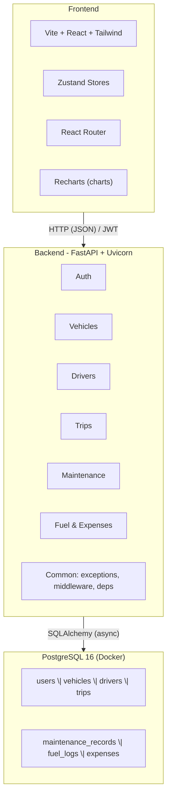
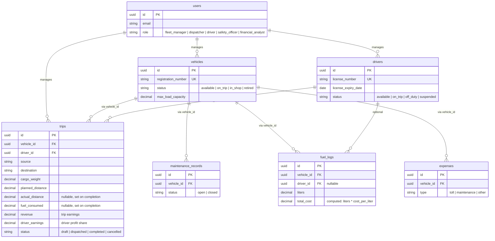
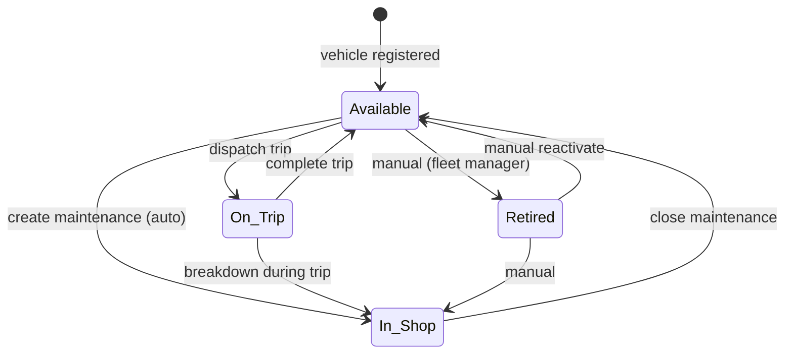
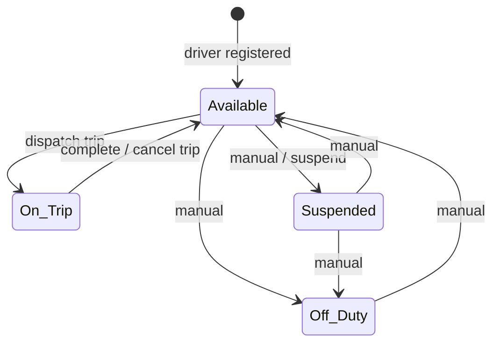
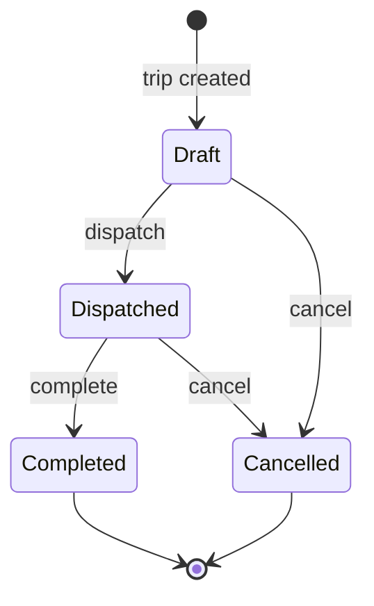
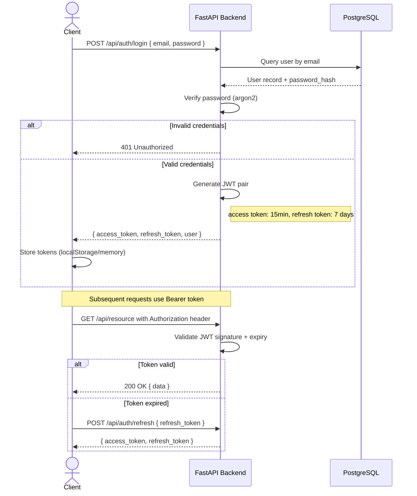
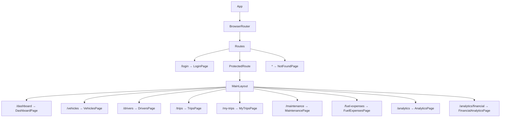
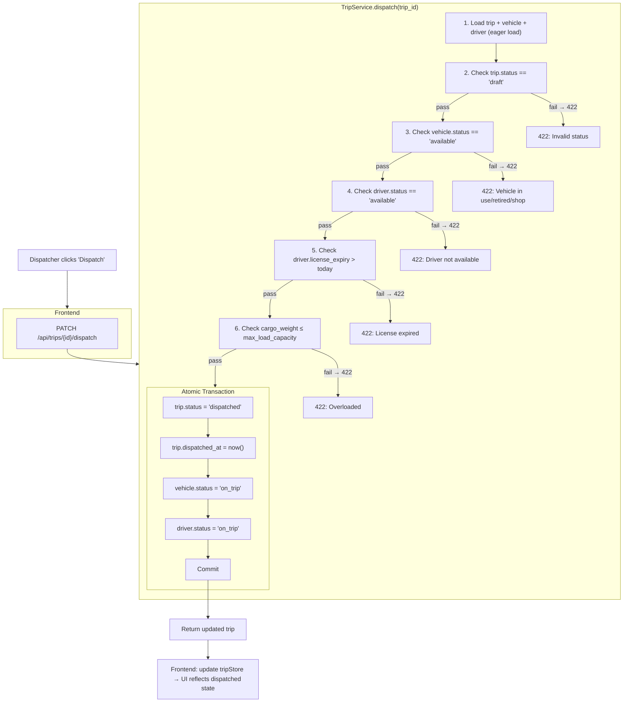
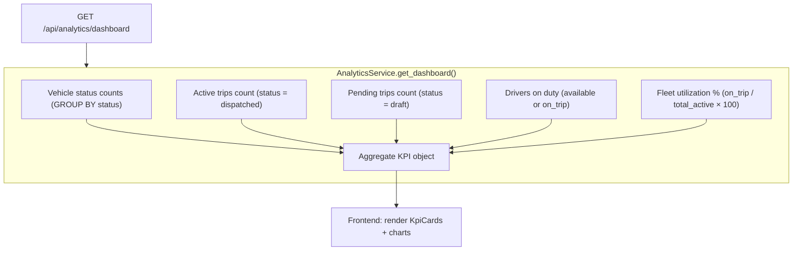

# TransitOps — Smart Transport Operations Platform

> **Design Document** · Monorepo · FastAPI (async) + React (Vite) + PostgreSQL · 8-Hour Hackathon

---

## Table of Contents

1. [Project Overview](#1-project-overview)
2. [System Architecture](#2-system-architecture)
3. [Directory Structure](#3-directory-structure)
4. [Data Model](#4-data-model)
5. [Entity Relationships](#5-entity-relationships)
6. [State Machines & Business Rules](#6-state-machines--business-rules)
7. [API Design](#7-api-design)
8. [Authentication & RBAC](#8-authentication--rbac)
9. [Frontend Architecture](#9-frontend-architecture)
10. [Data Flow](#10-data-flow)
11. [Implementation Roadmap (8 Hours)](#11-implementation-roadmap-8-hours)
12. [Performance & Optimization Notes](#12-performance--optimization-notes)
13. [Potential Optimizations](#13-potential-optimizations)

---

## 1. Project Overview

### 1.1 Problem Statement

Logistics companies manage vehicles, drivers, trips, maintenance, and expenses using spreadsheets and manual logbooks. This causes:

- Scheduling conflicts (double-booked vehicles/drivers)
- Underutilized fleet assets
- Missed maintenance leading to breakdowns
- Expired driver licenses going unnoticed
- Inaccurate expense tracking
- No real-time operational visibility

### 1.2 Solution

**TransitOps** is a centralized transport operations platform that digitizes the complete lifecycle:

- **Vehicle Registry** — master list with status tracking
- **Driver Management** — profiles, license tracking, safety scores
- **Trip Management** — dispatch workflow with automatic status transitions
- **Maintenance Tracking** — records trigger automatic vehicle status changes
- **Fuel & Expense Logging** — per-vehicle cost tracking
- **Analytics Dashboard** — KPIs, charts, CSV & PDF export

**User Roles:**
- **Fleet Manager** — Vehicle: Add/Edit/Delete/View. Driver: Add/Edit/Delete/View. Dashboard: View. Trip: View. Analytics: View.
- **Dispatcher** — Create trip, assign vehicles to driver, edit/delete/view trips. See vehicle and driver details.
- **Driver** — View only trips assigned to them: vehicle, source/destination, time/date, profit earned.
- **Safety Officer** — Suspend/Unsuspend drivers. Decide license validity. Check driver records & eligibility. Monitor safety score.
- **Financial Analyst** — View-only: fuel cost (from avg km/L), operational expenses, maintenance cost, profit per trip. Dashboard with Fuel Efficiency, Fleet Utilization, Operational Cost, Vehicle ROI. CSV & PDF export. Cannot add or edit anything.

### 1.3 Tech Stack

| Layer        | Technology                          |
| ------------ | ----------------------------------- |
| **Backend**  | Python 3.11+ · FastAPI · SQLAlchemy (async) · asyncpg |
| **Frontend** | Vite · React 18 · TypeScript        |
| **Styling**  | Tailwind CSS                        |
| **State**    | Zustand                             |
| **Database** | PostgreSQL 16 (Docker)              |
| **Auth**     | JWT (access + refresh tokens)       |
| **Infra**    | Docker (Postgres only) · docker-compose |

---

## 2. System Architecture



### 2.1 Design Principles

- **Modular monolith** — each domain (auth, vehicles, drivers, trips, maintenance, fuel_expenses, analytics) is a self-contained FastAPI `APIRouter` with its own `models.py`, `schemas.py`, `service.py`, and `router.py`.
- **Thin routers, fat services** — routers only handle HTTP concerns (parsing, status codes). All business logic lives in services.
- **Database transactions** — state transitions (e.g. dispatching a trip) that update multiple rows use atomic `async with db.session.begin_nested()`.
- **Enums over strings** — status fields use Python `Enum` + Postgres `VARCHAR` with CHECK constraints.
- **Separation of concerns** — every layer has a single responsibility; services never import HTTP concepts.

---

## 3. Directory Structure

```
transitops/
├── backend/
│   ├── app/
│   │   ├── __init__.py
│   │   ├── main.py                    # FastAPI app factory, CORS, lifespan
│   │   ├── config.py                  # Settings via pydantic-settings
│   │   ├── database.py                # async engine, sessionmaker, get_db dependency
│   │   ├── dependencies.py            # get_current_user, require_roles
│   │   ├── exceptions.py             # Custom HTTP exceptions
│   │   ├── middleware.py              # Request logging, timing (optional)
│   │   ├── modules/
│   │   │   ├── auth/
│   │   │   │   ├── __init__.py
│   │   │   │   ├── router.py          # POST /login, /register, /refresh, GET /me
│   │   │   │   ├── schemas.py         # LoginRequest, TokenResponse, UserOut
│   │   │   │   ├── service.py         # hash_password, verify_password, create_token
│   │   │   │   └── models.py          # User model
│   │   │   ├── vehicles/
│   │   │   │   ├── __init__.py
│   │   │   │   ├── router.py          # /api/vehicles CRUD + status PATCH
│   │   │   │   ├── schemas.py         # VehicleCreate, VehicleUpdate, VehicleOut
│   │   │   │   ├── service.py         # create, list, get, update, delete, change_status
│   │   │   │   └── models.py          # Vehicle model
│   │   │   ├── drivers/               # Same structure as vehicles
│   │   │   ├── trips/
│   │   │   │   ├── __init__.py
│   │   │   │   ├── router.py          # /api/trips CRUD + dispatch/complete/cancel
│   │   │   │   ├── schemas.py         # TripCreate, TripDispatch, TripComplete, TripOut
│   │   │   │   ├── service.py         # create, validate_business_rules, dispatch, complete, cancel
│   │   │   │   └── models.py          # Trip model
│   │   │   ├── maintenance/
│   │   │   │   ├── __init__.py
│   │   │   │   ├── router.py          # /api/maintenance CRUD + close
│   │   │   │   ├── schemas.py
│   │   │   │   ├── service.py         # create (auto InShop), close (auto Available)
│   │   │   │   └── models.py          # MaintenanceRecord model
│   │   │   ├── fuel_expenses/
│   │   │   │   ├── __init__.py
│   │   │   │   ├── router.py          # /api/fuel-logs, /api/expenses CRUD
│   │   │   │   ├── schemas.py
│   │   │   │   ├── service.py
│   │   │   │   └── models.py          # FuelLog, Expense models
│   │   │   └── analytics/
│   │   │       ├── __init__.py
│   │   │       ├── router.py          # GET /dashboard, /fuel-efficiency, /fleet-utilization, /operational-cost, /vehicle-roi, /profit-per-trip, /fuel-cost, /driver-trips, /export/csv, /export/pdf
│   │   │       ├── schemas.py         # DashboardResponse, etc.
│   │   │       └── service.py         # Aggregation queries
│   │   └── common/
│   │       ├── __init__.py
│   │       ├── enums.py               # Shared enums (VehicleStatus, DriverStatus, TripStatus, etc.)
│   │       └── utils.py               # CSV writer, date helpers
│   ├── alembic/
│   │   ├── env.py
│   │   └── versions/                  # Migration scripts
│   ├── alembic.ini
│   ├── requirements.txt
│   ├── pyproject.toml
│   └── .env.example
├── frontend/
│   ├── src/
│   │   ├── main.tsx                   # App entry point
│   │   ├── App.tsx                    # Router setup
│   │   ├── api/
│   │   │   └── client.ts             # Axios instance with interceptors
│   │   ├── stores/
│   │   │   ├── authStore.ts
│   │   │   ├── vehicleStore.ts
│   │   │   ├── driverStore.ts
│   │   │   ├── tripStore.ts
│   │   │   ├── maintenanceStore.ts
│   │   │   ├── fuelExpenseStore.ts
│   │   │   ├── analyticsStore.ts
│   │   │   └── uiStore.ts
│   │   ├── hooks/
│   │   │   ├── useAuth.ts
│   │   │   └── useDebounce.ts
│   │   ├── components/
│   │   │   ├── ui/                    # Reusable primitives
│   │   │   │   ├── Button.tsx
│   │   │   │   ├── Input.tsx
│   │   │   │   ├── Modal.tsx
│   │   │   │   ├── Select.tsx
│   │   │   │   ├── DataTable.tsx
│   │   │   │   ├── StatusBadge.tsx
│   │   │   │   ├── KpiCard.tsx
│   │   │   │   ├── LoadingSpinner.tsx
│   │   │   │   └── ConfirmDialog.tsx
│   │   │   ├── layout/
│   │   │   │   ├── MainLayout.tsx
│   │   │   │   ├── Sidebar.tsx
│   │   │   │   └── Header.tsx
│   │   │   ├── auth/
│   │   │   │   └── ProtectedRoute.tsx
│   │   │   ├── vehicles/
│   │   │   │   ├── VehicleTable.tsx
│   │   │   │   └── VehicleForm.tsx
│   │   │   ├── drivers/
│   │   │   │   ├── DriverTable.tsx
│   │   │   │   └── DriverForm.tsx
│   │   │   ├── trips/
│   │   │   │   ├── TripTable.tsx
│   │   │   │   ├── TripForm.tsx
│   │   │   │   └── TripDetail.tsx
│   │   │   ├── maintenance/
│   │   │   │   ├── MaintenanceTable.tsx
│   │   │   │   └── MaintenanceForm.tsx
│   │   │   ├── fuel/
│   │   │   │   ├── FuelLogTable.tsx
│   │   │   │   ├── FuelLogForm.tsx
│   │   │   │   ├── ExpenseTable.tsx
│   │   │   │   └── ExpenseForm.tsx
│   │   │   └── analytics/
│   │   │       ├── FleetUtilizationChart.tsx
│   │   │       ├── FuelEfficiencyChart.tsx
│   │   │       ├── CostBreakdownChart.tsx
│   │   │       ├── ProfitPerTripChart.tsx
│   │   │       └── ExportButton.tsx
│   │   ├── pages/
│   │   │   ├── LoginPage.tsx
│   │   │   ├── DashboardPage.tsx
│   │   │   ├── VehiclesPage.tsx
│   │   │   ├── DriversPage.tsx
│   │   │   ├── TripsPage.tsx
│   │   │   ├── MyTripsPage.tsx               # Driver: own trips with profit
│   │   │   ├── MaintenancePage.tsx
│   │   │   ├── FuelExpensesPage.tsx
│   │   │   ├── FinancialAnalyticsPage.tsx    # Financial analyst dashboard
│   │   │   ├── AnalyticsPage.tsx             # Fleet manager analytics
│   │   │   └── NotFoundPage.tsx
│   │   ├── types/
│   │   │   └── index.ts              # Shared TypeScript interfaces
│   │   ├── utils/
│   │   │   ├── cn.ts                 # clsx + tailwind-merge helper
│   │   │   ├── formatters.ts         # Currency, date, number formatters
│   │   │   └── constants.ts          # API base URL, status options, role labels
│   │   └── styles/
│   │       └── globals.css           # Tailwind directives
│   ├── index.html
│   ├── package.json
│   ├── vite.config.ts
│   ├── tsconfig.json
│   ├── tailwind.config.ts
│   └── postcss.config.js
├── docker-compose.yml                 # PostgreSQL only
├── .env.example                       # Backend env vars
└── README.md
```

---

## 4. Data Model

### 4.1 Entity Summary

| Entity               | Table                | Key Fields (beyond basics)                        |
| -------------------- | -------------------- | ------------------------------------------------- |
| User                 | `users`              | email (unique), password_hash, role (enum)        |
| Vehicle              | `vehicles`           | registration_number (unique), status (enum)       |
| Driver               | `drivers`            | license_number (unique), license_expiry_date, status (enum) |
| Trip                 | `trips`              | vehicle_id (FK), driver_id (FK), status (enum), revenue, driver_earnings |
| Maintenance Record   | `maintenance_records`| vehicle_id (FK), status (enum: open/closed)       |
| Fuel Log             | `fuel_logs`          | vehicle_id (FK), liters, cost_per_liter, total_cost (computed) |
| Expense              | `expenses`           | vehicle_id (FK), type (enum: toll/maintenance/other), amount |

### 4.2 Detailed Schema

```sql
-- Users & Auth
CREATE TABLE users (
    id              UUID PRIMARY KEY DEFAULT gen_random_uuid(),
    email           VARCHAR(255) UNIQUE NOT NULL,
    password_hash   VARCHAR(255) NOT NULL,
    role            VARCHAR(20) NOT NULL CHECK (role IN ('fleet_manager','dispatcher','driver','safety_officer','financial_analyst')),
    name            VARCHAR(255) NOT NULL,
    is_active       BOOLEAN DEFAULT TRUE,
    created_at      TIMESTAMPTZ DEFAULT NOW(),
    updated_at      TIMESTAMPTZ DEFAULT NOW()
);

-- Vehicles
CREATE TABLE vehicles (
    id                  UUID PRIMARY KEY DEFAULT gen_random_uuid(),
    registration_number VARCHAR(50) UNIQUE NOT NULL,
    name                VARCHAR(255) NOT NULL,
    model               VARCHAR(255),
    vehicle_type        VARCHAR(100),
    max_load_capacity   DECIMAL(10,2) NOT NULL,         -- kg
    odometer            DECIMAL(10,2) DEFAULT 0,        -- km
    acquisition_cost    DECIMAL(12,2),
    status              VARCHAR(20) NOT NULL DEFAULT 'available'
                        CHECK (status IN ('available','on_trip','in_shop','retired')),
    created_at          TIMESTAMPTZ DEFAULT NOW(),
    updated_at          TIMESTAMPTZ DEFAULT NOW()
);
CREATE INDEX idx_vehicles_status ON vehicles(status);
CREATE INDEX idx_vehicles_type ON vehicles(vehicle_type);

-- Drivers
CREATE TABLE drivers (
    id                  UUID PRIMARY KEY DEFAULT gen_random_uuid(),
    name                VARCHAR(255) NOT NULL,
    license_number      VARCHAR(100) UNIQUE NOT NULL,
    license_category    VARCHAR(50),
    license_expiry_date DATE NOT NULL,
    contact_number      VARCHAR(20),
    safety_score        DECIMAL(5,2) DEFAULT 100.00,
    status              VARCHAR(20) NOT NULL DEFAULT 'available'
                        CHECK (status IN ('available','on_trip','off_duty','suspended')),
    created_at          TIMESTAMPTZ DEFAULT NOW(),
    updated_at          TIMESTAMPTZ DEFAULT NOW()
);
CREATE INDEX idx_drivers_status ON drivers(status);
CREATE INDEX idx_drivers_license_expiry ON drivers(license_expiry_date);

-- Trips
CREATE TABLE trips (
    id              UUID PRIMARY KEY DEFAULT gen_random_uuid(),
    source          VARCHAR(255) NOT NULL,
    destination     VARCHAR(255) NOT NULL,
    vehicle_id      UUID NOT NULL REFERENCES vehicles(id),
    driver_id       UUID NOT NULL REFERENCES drivers(id),
    cargo_weight    DECIMAL(10,2),                      -- kg
    planned_distance DECIMAL(10,2),                     -- km
    actual_distance  DECIMAL(10,2),                     -- km (set on completion)
    status          VARCHAR(20) NOT NULL DEFAULT 'draft'
                    CHECK (status IN ('draft','dispatched','completed','cancelled')),
    dispatched_at   TIMESTAMPTZ,
    completed_at    TIMESTAMPTZ,
    final_odometer  DECIMAL(10,2),                      -- km (set on completion)
    fuel_consumed   DECIMAL(10,2),                      -- liters (set on completion)
    revenue         DECIMAL(12,2),                      -- trip earnings (set on completion)
    driver_earnings DECIMAL(10,2),                      -- driver profit share (set on completion)
    notes           TEXT,
    created_at      TIMESTAMPTZ DEFAULT NOW(),
    updated_at      TIMESTAMPTZ DEFAULT NOW()
);
CREATE INDEX idx_trips_status ON trips(status);
CREATE INDEX idx_trips_vehicle ON trips(vehicle_id);
CREATE INDEX idx_trips_driver ON trips(driver_id);

-- Maintenance Records
CREATE TABLE maintenance_records (
    id              UUID PRIMARY KEY DEFAULT gen_random_uuid(),
    vehicle_id      UUID NOT NULL REFERENCES vehicles(id),
    description     TEXT NOT NULL,
    type            VARCHAR(100),                        -- e.g. 'Oil Change', 'Tire Replacement'
    cost            DECIMAL(10,2),
    status          VARCHAR(10) NOT NULL DEFAULT 'open'
                    CHECK (status IN ('open','closed')),
    scheduled_date  DATE,
    completed_date  DATE,
    notes           TEXT,
    created_at      TIMESTAMPTZ DEFAULT NOW(),
    updated_at      TIMESTAMPTZ DEFAULT NOW()
);
CREATE INDEX idx_maintenance_vehicle ON maintenance_records(vehicle_id);
CREATE INDEX idx_maintenance_status ON maintenance_records(status);

-- Fuel Logs
CREATE TABLE fuel_logs (
    id              UUID PRIMARY KEY DEFAULT gen_random_uuid(),
    vehicle_id      UUID NOT NULL REFERENCES vehicles(id),
    driver_id       UUID REFERENCES drivers(id),          -- nullable
    liters          DECIMAL(10,2) NOT NULL,
    cost_per_liter  DECIMAL(10,2) NOT NULL,
    total_cost      DECIMAL(10,2) GENERATED ALWAYS AS (liters * cost_per_liter) STORED,
    date            DATE NOT NULL,
    notes           TEXT,
    created_at      TIMESTAMPTZ DEFAULT NOW()
);
CREATE INDEX idx_fuel_vehicle ON fuel_logs(vehicle_id);
CREATE INDEX idx_fuel_date ON fuel_logs(date);

-- Expenses
CREATE TABLE expenses (
    id              UUID PRIMARY KEY DEFAULT gen_random_uuid(),
    vehicle_id      UUID NOT NULL REFERENCES vehicles(id),
    type            VARCHAR(20) NOT NULL CHECK (type IN ('toll','maintenance','other')),
    amount          DECIMAL(10,2) NOT NULL,
    description     TEXT,
    date            DATE NOT NULL,
    created_at      TIMESTAMPTZ DEFAULT NOW()
);
CREATE INDEX idx_expenses_vehicle ON expenses(vehicle_id);
CREATE INDEX idx_expenses_type ON expenses(type);
```

---

## 5. Entity Relationships



**Key relational rules enforced at the service layer:**
- A vehicle without `status = 'available'` cannot be linked to a new `trip` in `dispatched` status
- A driver without `status = 'available'` and a valid license cannot be linked to a new dispatched trip
- Creating an `open` maintenance record vehicle-links to a vehicle and flips its status to `in_shop`
- Completing/Closing trips/maintenance must reset the associated vehicle/driver status atomically

---

## 6. State Machines & Business Rules

### 6.1 Vehicle State Machine



### 6.2 Driver State Machine



### 6.3 Trip State Machine



### 6.4 Business Rules (enforced in TripService)

| #  | Rule                                                         | Where Enforced          |
| -- | ------------------------------------------------------------ | ----------------------- |
| 1  | Vehicle registration_number must be unique                   | DB UNIQUE constraint    |
| 2  | Retired or In Shop vehicles cannot be dispatched              | `trip_service.dispatch()` |
| 3  | Drivers with expired licenses cannot be assigned              | `trip_service.dispatch()` |
| 4  | Suspended drivers cannot be assigned                          | `trip_service.dispatch()` |
| 5  | A driver already On Trip cannot be assigned again             | `trip_service.dispatch()` |
| 6  | A vehicle already On Trip cannot be assigned again            | `trip_service.dispatch()` |
| 7  | Cargo weight must not exceed vehicle max_load_capacity        | `trip_service.dispatch()` |
| 8  | Dispatching → vehicle + driver → On Trip (atomic transaction) | `trip_service.dispatch()` |
| 9  | Completing → vehicle + driver → Available (atomic)            | `trip_service.complete()` |
| 10 | Cancelling dispatched trip → restore vehicle + driver         | `trip_service.cancel()`   |
| 11 | Creating open maintenance → vehicle → In Shop                 | `maintenance_service.create()` |
| 12 | Closing maintenance → vehicle → Available (if not retired)    | `maintenance_service.close()` |

---

## 7. API Design

### 7.1 Authentication

| Method | Path               | Auth     | Role          | Description          |
| ------ | ------------------ | -------- | ------------- | -------------------- |
| POST   | `/api/auth/login`  | No       | —             | Login, returns JWT   |
| POST   | `/api/auth/register` | Yes    | fleet_manager | Create new user      |
| GET    | `/api/auth/me`     | Yes      | any           | Current user profile |
| POST   | `/api/auth/refresh`| No       | —             | Refresh access token |

### 7.2 Vehicles

| Method | Path                        | Auth | Role                          | Description               |
| ------ | --------------------------- | ---- | ----------------------------- | ------------------------- |
| GET    | `/api/vehicles`             | Yes  | fleet_manager, dispatcher     | List                      |
| POST   | `/api/vehicles`             | Yes  | fleet_manager                 | Add vehicle               |
| GET    | `/api/vehicles/{id}`        | Yes  | fleet_manager, dispatcher     | Get vehicle by ID         |
| PUT    | `/api/vehicles/{id}`        | Yes  | fleet_manager                 | Edit vehicle              |
| DELETE | `/api/vehicles/{id}`        | Yes  | fleet_manager                 | Delete vehicle            |
| PATCH  | `/api/vehicles/{id}/status` | Yes  | fleet_manager                 | Change status             |

### 7.3 Drivers

| Method | Path                            | Auth | Role                                  | Description                         |
| ------ | ------------------------------- | ---- | ------------------------------------- | ----------------------------------- |
| GET    | `/api/drivers`                  | Yes  | fleet_manager, dispatcher, safety_officer | List                            |
| POST   | `/api/drivers`                  | Yes  | fleet_manager                         | Add driver                          |
| GET    | `/api/drivers/{id}`             | Yes  | fleet_manager, dispatcher, safety_officer | Get driver by ID                 |
| PUT    | `/api/drivers/{id}`             | Yes  | fleet_manager                         | Edit driver                         |
| DELETE | `/api/drivers/{id}`             | Yes  | fleet_manager                         | Delete driver                       |
| PATCH  | `/api/drivers/{id}/status`      | Yes  | safety_officer                        | Suspend/unsuspend driver            |
| PATCH  | `/api/drivers/{id}/safety-score`| Yes  | safety_officer                        | Update safety score + license review |

### 7.4 Trips

| Method | Path                          | Auth | Role                          | Description                          |
| ------ | ----------------------------- | ---- | ----------------------------- | ------------------------------------ |
| GET    | `/api/trips`                  | Yes  | fleet_manager, dispatcher     | List all trips                      |
| POST   | `/api/trips`                  | Yes  | dispatcher                    | Create trip                          |
| GET    | `/api/trips/{id}`             | Yes  | fleet_manager, dispatcher, driver¹ | Get trip detail                  |
| PUT    | `/api/trips/{id}`             | Yes  | dispatcher                    | Edit trip                            |
| DELETE | `/api/trips/{id}`             | Yes  | dispatcher                    | Delete trip                          |
| PATCH  | `/api/trips/{id}/dispatch`    | Yes  | dispatcher                    | Dispatch (assign vehicle + driver)   |
| PATCH  | `/api/trips/{id}/complete`    | Yes  | dispatcher                    | Complete trip                        |
| PATCH  | `/api/trips/{id}/cancel`      | Yes  | dispatcher                    | Cancel trip                          |

¹ Driver sees only their own trip details — vehicle, destination, time/date, and profit earned.

**Request/Response Examples:**

```
POST /api/trips/{id}/dispatch
→ 200 { "message": "Trip dispatched", "trip": { ... } }
→ 422 { "detail": "Vehicle Van-05 is already On Trip" }
→ 422 { "detail": "Cargo weight 600kg exceeds max load 500kg" }

PATCH /api/trips/{id}/complete
Body: { "final_odometer": 15250.5, "fuel_consumed": 45.2 }
→ 200 { "message": "Trip completed", "trip": { ... } }
```

### 7.5 Maintenance

| Method | Path                           | Auth | Role                                | Description                       |
| ------ | ------------------------------ | ---- | ----------------------------------- | --------------------------------- |
| GET    | `/api/maintenance`             | Yes  | fleet_manager, financial_analyst    | List                              |
| POST   | `/api/maintenance`             | Yes  | fleet_manager                       | Create (auto flips vehicle to In Shop) |
| GET    | `/api/maintenance/{id}`        | Yes  | fleet_manager, financial_analyst    | Get maintenance record            |
| PUT    | `/api/maintenance/{id}`        | Yes  | fleet_manager                       | Update maintenance record         |
| PATCH  | `/api/maintenance/{id}/close`  | Yes  | fleet_manager                       | Close (restores vehicle to Available) |

### 7.6 Fuel & Expenses

| Method | Path                 | Auth | Role                      | Description            |
| ------ | -------------------- | ---- | ------------------------- | ---------------------- |
| GET    | `/api/fuel-logs`     | Yes  | financial_analyst         | List fuel logs         |
| POST   | `/api/fuel-logs`     | Yes  | fleet_manager             | Create fuel log        |
| GET    | `/api/expenses`      | Yes  | financial_analyst         | List expenses          |
| POST   | `/api/expenses`      | Yes  | fleet_manager             | Create expense         |

### 7.7 Analytics

| Method | Path                                  | Auth | Role               | Description                                |
| ------ | ------------------------------------- | ---- | ------------------ | ------------------------------------------ |
| GET    | `/api/analytics/dashboard`            | Yes  | fleet_manager      | KPI dashboard summary                      |
| GET    | `/api/analytics/fuel-efficiency`      | Yes  | financial_analyst  | Fuel efficiency (km/L) by vehicle          |
| GET    | `/api/analytics/fleet-utilization`    | Yes  | financial_analyst  | Fleet utilization percentage               |
| GET    | `/api/analytics/operational-cost`     | Yes  | financial_analyst  | Operational cost breakdown                 |
| GET    | `/api/analytics/vehicle-roi`          | Yes  | financial_analyst  | Vehicle ROI                                |
| GET    | `/api/analytics/profit-per-trip`      | Yes  | financial_analyst  | Profit per trip (revenue - costs)          |
| GET    | `/api/analytics/fuel-cost`            | Yes  | financial_analyst  | Fuel cost analysis (avg km/L, cost/km)     |
| GET    | `/api/analytics/driver-trips`         | Yes  | driver             | Own trips with vehicle, route, earnings    |
| GET    | `/api/analytics/export/csv`           | Yes  | financial_analyst  | CSV export                                 |
| GET    | `/api/analytics/export/pdf`           | Yes  | financial_analyst  | PDF report                                 |

### 7.8 API Response Envelope

```json
{
  "success": true,
  "data": { ... },
  "message": "optional message",
  "errors": null
}
```

Paginated list responses:

```json
{
  "success": true,
  "data": [ ... ],
  "pagination": {
    "page": 1,
    "per_page": 20,
    "total": 150,
    "total_pages": 8
  }
}
```

---

## 8. Authentication & RBAC

### 8.1 Auth Flow



### 8.2 JWT Payload

```json
{
  "sub": "user-uuid",
  "email": "user@example.com",
  "role": "fleet_manager",
  "exp": 1712345678,
  "iat": 1712344778
}
```

### 8.3 Role-Permission Matrix

| Feature                                       | Fleet Manager | Dispatcher | Driver | Safety Officer | Financial Analyst |
| --------------------------------------------- | :-----------: | :--------: | :----: | :------------: | :---------------: |
| Vehicles (Add/Edit/Delete)                    | ✅            | ❌         | ❌     | ❌             | ❌                |
| Vehicles (View)                               | ✅            | ✅         | ❌     | ❌             | ❌                |
| Drivers (Add/Edit/Delete)                     | ✅            | ❌         | ❌     | ❌             | ❌                |
| Drivers (View)                                | ✅            | ✅         | ❌     | ✅             | ❌                |
| Drivers (Suspend/Unsuspend)                   | ❌            | ❌         | ❌     | ✅             | ❌                |
| Drivers (License review / Safety score)       | ❌            | ❌         | ❌     | ✅             | ❌                |
| Dashboard (View)                              | ✅            | ❌         | ❌     | ❌             | ❌                |
| Trips (Create/Assign/Edit/Delete/Dispatch)    | ❌            | ✅         | ❌     | ❌             | ❌                |
| Trips (View)                                  | ✅            | ✅         | ✅¹    | ❌             | ❌                |
| Analytics (General view)                      | ✅            | ❌         | ❌     | ❌             | ❌                |
| Analytics (Fuel cost / Op cost / Profit / ROI)| ❌            | ❌         | ❌     | ❌             | ✅                |
| Analytics (Fuel Efficiency / Fleet Utilization)| ❌           | ❌         | ❌     | ❌             | ✅                |
| CSV Export                                    | ❌            | ❌         | ❌     | ❌             | ✅                |
| PDF Export                                    | ❌            | ❌         | ❌     | ❌             | ✅                |

¹ Driver views only their own assigned trips — vehicle allocated, source/destination, time/date, and profit earned.

### 8.4 RBAC Implementation

```python
# dependencies.py
from fastapi import Depends, HTTPException, status
from fastapi.security import HTTPBearer, HTTPAuthorizationCredentials

security = HTTPBearer()

async def get_current_user(credentials: HTTPAuthorizationCredentials = Depends(security)):
    payload = decode_jwt(credentials.credentials)
    if payload is None:
        raise HTTPException(status.HTTP_401_UNAUTHORIZED)
    return payload

def require_roles(*roles: str):
    async def role_checker(current_user = Depends(get_current_user)):
        if current_user["role"] not in roles:
            raise HTTPException(status.HTTP_403_FORBIDDEN)
        return current_user
    return role_checker
```

---

## 9. Frontend Architecture

### 9.1 Route Map

```
/login                          → LoginPage              [public]
/dashboard                      → DashboardPage           [fleet_manager]
/vehicles                       → VehiclesPage            [fleet_manager, dispatcher]
/drivers                        → DriversPage             [fleet_manager, dispatcher, safety_officer]
/trips                          → TripsPage               [fleet_manager, dispatcher]
/trips/new                      → TripsPage (create)      [dispatcher]
/trips/:id                      → TripsPage (detail)      [fleet_manager, dispatcher, driver]
/my-trips                       → MyTripsPage             [driver]
/maintenance                    → MaintenancePage         [fleet_manager, financial_analyst]
/fuel-expenses                  → FuelExpensesPage        [fleet_manager, financial_analyst]
/analytics                      → AnalyticsPage            [fleet_manager]
/analytics/financial            → FinancialAnalyticsPage  [financial_analyst]
```

### 9.2 Component Tree



### 9.3 Zustand Store Pattern

```typescript
// stores/vehicleStore.ts
import { create } from 'zustand';
import api from '../api/client';

interface VehicleStore {
  vehicles: Vehicle[];
  total: number;
  loading: boolean;
  filters: { status?: string; type?: string; search?: string };
  fetchVehicles: (page?: number) => Promise<void>;
  createVehicle: (data: VehicleCreate) => Promise<void>;
  updateVehicle: (id: string, data: VehicleUpdate) => Promise<void>;
  deleteVehicle: (id: string) => Promise<void>;
  setFilters: (filters: Partial<VehicleFilters>) => void;
}
```

### 9.4 Key UI Patterns

- **DataTable** — shared reusable component: columns config, sortable headers, pagination, row click → detail/edit
- **Modal-based CRUD** — all forms open as modals over the list page (no route change for create/edit)
- **Optimistic UI** — trip dispatch/complete buttons update state immediately, revert on error
- **Dark mode** — via `class` strategy in Tailwind + `uiStore.darkMode` persisted in localStorage
- **Toast notifications** — success/error feedback after mutations

### 9.5 Analytics Charts (Recharts)

| Chart                          | Type             | Data Source                               | Role               |
| ------------------------------ | ---------------- | ----------------------------------------- | ------------------ |
| Fleet Utilization              | Pie / Donut      | Vehicle status counts                     | Financial Analyst  |
| Fuel Efficiency                | Bar              | Distance / Fuel per vehicle               | Financial Analyst  |
| Operational Cost               | Line (time)      | Monthly maintenance + fuel costs          | Financial Analyst  |
| Vehicle ROI                    | Horizontal Bar   | (Revenue - Cost) / Acquisition            | Financial Analyst  |
| Profit Per Trip                | Bar              | Revenue - (fuel + maintenance + expenses) | Financial Analyst  |
| Fuel Cost Analysis             | Combo            | Avg km/L, cost/km per vehicle             | Financial Analyst  |

---

## 10. Data Flow

### 10.1 Trip Dispatch Flow (most complex operation)



### 10.2 Dashboard Aggregation Flow



---

## 11. Implementation Roadmap (8 Hours)

### Phase 1: Scaffolding + Auth (1.5h)

| Time | Task                                                         | Output                                          |
| ---- | ------------------------------------------------------------ | ----------------------------------------------- |
| 0:00 | Init backend: FastAPI project, config, database, alembic     | `/backend` scaffold, first migration            |
| 0:20 | User model + migration                                       | `users` table                                   |
| 0:30 | Auth endpoints (login, register, me, refresh)                | Working auth with JWT                           |
| 1:00 | Init frontend: Vite + React + Tailwind + routing + Axios     | `/frontend` scaffold, login page                |
| 1:15 | Auth store + ProtectedRoute + login integration              | Login flow end-to-end                           |
| 1:30 | MainLayout + Sidebar + role-based nav                        | Navigation structure                            |

### Phase 2: Vehicles + Drivers (1.5h)

| Time | Task                                                         | Output                                          |
| ---- | ------------------------------------------------------------ | ----------------------------------------------- |
| 1:30 | Vehicle model + CRUD API                                     | `/api/vehicles` endpoints (fleet_manager)       |
| 1:50 | Vehicle list page + create/edit modal                        | Vehicle management UI (fleet_manager)           |
| 2:10 | Driver model + CRUD API                                      | `/api/drivers` endpoints (fleet_manager)        |
| 2:30 | Driver list page + create/edit modal                         | Driver management UI (fleet_manager)            |
| 3:00 | Driver suspend + safety score endpoints                      | `/api/drivers/{id}/status + safety-score` (safety_officer) |

### Phase 3: Trips (1.5h)

| Time | Task                                                         | Output                                          |
| ---- | ------------------------------------------------------------ | ----------------------------------------------- |
| 3:00 | Trip model + migration (add revenue, driver_earnings fields) | `trips` table                                   |
| 3:15 | Trip CRUD API (create draft)                                 | `/api/trips` endpoints (dispatcher)             |
| 3:30 | TripService: dispatch with all business rules                | `/api/trips/{id}/dispatch` (dispatcher)         |
| 3:45 | TripService: complete (odometer, fuel, revenue) + cancel     | `/api/trips/{id}/complete + /cancel` (dispatcher) |
| 4:00 | Trip list + detail page with status badges                   | Trip management UI (fleet_manager, dispatcher)  |
| 4:15 | Trip creation form + vehicle/driver assignment               | Trip create form (dispatcher)                   |
| 4:30 | MyTripsPage: driver's own trips with vehicle, route, earnings| Driver trip view (driver)                       |

### Phase 4: Maintenance + Fuel/Expenses (1.5h)

| Time | Task                                                         | Output                                          |
| ---- | ------------------------------------------------------------ | ----------------------------------------------- |
| 4:30 | Maintenance model + migration                                | `maintenance_records` table                     |
| 4:45 | Maintenance API (create → auto InShop, close → restore)      | `/api/maintenance` endpoints (fleet_manager)    |
| 5:00 | Maintenance UI (list, create modal, close action)            | Maintenance management UI                       |
| 5:15 | FuelLog model + migration + API                              | fuel logging endpoints                          |
| 5:30 | Expense model + migration + API                              | expense tracking endpoints                      |
| 5:45 | Fuel/Expense list pages                                      | View-only pages (financial_analyst)             |

### Phase 5: Dashboard + Analytics (1.5h)

| Time | Task                                                         | Output                                          |
| ---- | ------------------------------------------------------------ | ----------------------------------------------- |
| 6:00 | Dashboard aggregation endpoint                               | `GET /api/analytics/dashboard` (fleet_manager)  |
| 6:15 | KPI cards + dashboard page                                   | Live KPI dashboard                              |
| 6:30 | Fuel efficiency + fleet utilization + fuel cost endpoints    | Chart data APIs (financial_analyst)             |
| 6:45 | Profit-per-trip + vehicle ROI endpoints                      | Financial analytics APIs                        |
| 7:00 | FinancialAnalyticsPage with Recharts integration             | Full financial dashboard                        |
| 7:15 | CSV + PDF export endpoints                                   | Download reports (financial_analyst)            |

### Phase 6: Polish (0.5h)

| Time | Task                                                         | Output                                          |
| ---- | ------------------------------------------------------------ | ----------------------------------------------- |
| 7:30 | Dark mode toggle + role-based sidebar nav                    | Theme switching, nav filtering                  |
| 7:45 | Error handling + form validation + toast notifications       | Production-quality UX                           |
| 8:00 | Final testing + README                                        | Ship                                             |

---

## 12. Performance & Optimization Notes

### 12.1 Database

- **Indexes** on all FK columns and frequently filtered columns (status, date, license_expiry)
- **Composite indexes** for common filter combinations:
  - `(vehicle_type, status)` for vehicle listing
  - `(status, created_at)` for trip listing
- **Computed column** for `fuel_logs.total_cost` — no runtime calculation
- **Connection pooling** via asyncpg pool (default 5-20 connections)

### 12.2 Backend

- **Lazy loading** — SQLAlchemy relationships use `lazy='selectin'` for eager loading of immediate relations; avoid N+1 queries
- **Pagination** — all list endpoints use `page` & `per_page` (default 20, max 100)
- **Query optimization** — dashboard aggregation uses a single `GROUP BY` query instead of 6 separate `COUNT` queries
- **Caching** — optional: cache dashboard KPI results for 30s using `cachetools.TTLCache` (if time permits)

### 12.3 Frontend

- **Debounced search** — 300ms debounce on search inputs to avoid excessive API calls
- **Data prefetching** — Trip creation form fetches available vehicles/drivers in parallel
- **Memoized selectors** — use `useMemo`/`useCallback` for filtered/sorted lists
- **Code splitting** — React.lazy + Suspense for analytics and heavy pages

---

## 13. Potential Optimizations

These are identified improvements beyond the 8-hour scope:

- **Email reminders** — Background task (APScheduler) to check expiring licenses daily and send notifications via SMTP
- **Document management** — S3/MinIO file upload for vehicle documents (insurance, registration)
- **WebSocket real-time updates** — Push status changes to connected clients when another user dispatches/completes trips
- **Audit log** — `audit_logs` table tracking all status changes (who changed what and when)
- **Soft delete** — Add `deleted_at` to vehicles/drivers instead of hard delete
- **API rate limiting** — SlowAPI or custom middleware to prevent abuse
- **Comprehensive test suite** — pytest for backend (unit + integration), Vitest + React Testing Library for frontend
